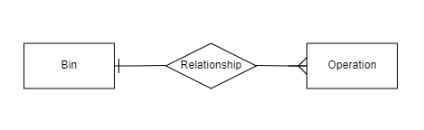

### Prerequisites

----

You need to install docker to run project.
* [Docker](https://www.docker.com/get-started)
 
### Installation

----

 - After you download repo, in root folder run:
  ```sh
    docker-compose up
  ```

### End-Points

----

* Api Root
  ```sh
    http://localhost:8000/
  ```
    
#### Question 1

*  End-point
    ```sh
     http://localhost:8000/last-points/
   ```
* This end-point return list of navigation records. I used '__range' to filter last records in 48 hours.


* 'startswith' also can be used (it compares by matching char by char to filter).


* Timescale DB can also be used, because that have options to perform queries according to time.


#### Question 2

* End-point
    ```sh
      http://localhost:8000/collection-frequency/
    ```
   
* Entity-relationship diagram:

  * Bin could contain more than one operation and different operations can link to same Bin. Thus, there is a one to many relationship between them.


&nbsp;&nbsp;&nbsp;&nbsp;&nbsp;&nbsp;&nbsp;&nbsp;&nbsp;&nbsp;&nbsp;&nbsp;&nbsp;&nbsp;&nbsp;&nbsp;&nbsp;&nbsp;&nbsp;&nbsp;&nbsp;&nbsp;&nbsp;&nbsp;&nbsp;&nbsp;&nbsp;&nbsp;&nbsp;&nbsp;&nbsp;&nbsp;&nbsp;&nbsp;&nbsp;&nbsp;&nbsp;&nbsp;&nbsp;&nbsp;&nbsp;&nbsp;&nbsp;&nbsp;&nbsp;&nbsp;&nbsp;&nbsp;&nbsp;&nbsp;&nbsp;&nbsp;&nbsp;&nbsp;&nbsp;&nbsp;&nbsp;&nbsp;&nbsp;&nbsp;&nbsp;&nbsp;&nbsp;&nbsp;&nbsp;&nbsp;&nbsp;&nbsp;&nbsp;&nbsp;&nbsp;&nbsp;&nbsp;&nbsp;&nbsp;&nbsp;&nbsp;&nbsp;&nbsp;&nbsp;&nbsp;&nbsp;&nbsp;&nbsp;&nbsp;&nbsp;&nbsp;&nbsp;&nbsp;&nbsp;&nbsp;&nbsp;&nbsp;&nbsp;&nbsp;&nbsp;
  - --------------------------------------------------------------------------------------------------------------

